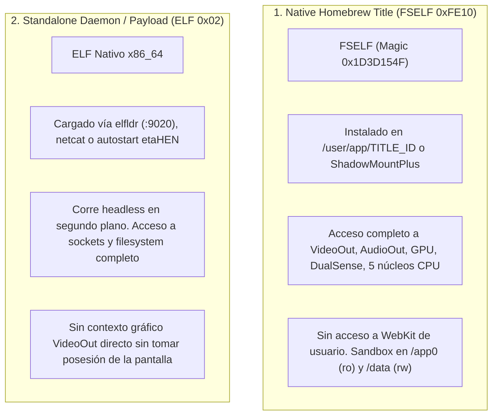

# PS5 Scene & Homebrew Development Skill

> Complete technical guide for developing, reverse engineering, and packaging native homebrew applications, background daemons, and payloads for the PlayStation 5 (Firmwares 1.00 – 13.60+ / etaHEN / ShadowMountPlus).

---

## 1. System Architecture & Execution Environments

The PS5 runs **Prospero OS**, a heavily modified derivative of **FreeBSD 12** executing on an **x86_64 AMD Zen 2** APU with RDNA 2 graphics.

### The Two Execution Models



---

## 2. Toolchains & Compilación Cruzada

### A. Entorno C / C++ (ps5-payload-sdk)
El estándar de la scene es **`ps5-payload-sdk`** junto con herramientas basadas en LLVM 18 (`prospero-clang`, `prospero-lld`, `prospero-ar`):

* **Compilador C/C++:** `clang-18 -target x86_64-sie-ps5` (o wrapper `prospero-clang18`)
* **Flags recomendados:**
  ```sh
  -std=c++20 -O2 -fPIC -ffunction-sections -fdata-sections -fno-exceptions -fno-rtti
  ```
* **Librerías portadas (PacBrew):** Sysroot aislado que provee `libcurl`, `openssl`, `opus`, `libavcodec`, `zlib`, `zstd`.

### B. Entorno Rust
Para compilar código Rust (como Tooly o daemons en Axum/Tokio):
1. **Target:** Utiliza `x86_64-unknown-freebsd` o un target JSON de Rust con ABI SysV AMD64:
   ```sh
   cargo build --release --target x86_64-unknown-freebsd
   ```
2. **Dependencias de Red:** Usa implementaciones basadas en Rustls o sockets estándar FreeBSD.

---

## 3. Trampa Crítica: Memoria y Allocator (`--wrap=malloc`)

### El Problema
En títulos nativos de PS5, el heap de la `libc` estándar es limitado y se fragmenta con rapidez (provocando errores como `Could not allocate memory` en decodificadores o servidores de red).

### La Solución (Patrón ProsperoLight / OpenNOW)
Interceptar la familia `malloc` con el linker (`-Wl,--wrap=malloc,--wrap=calloc,--wrap=realloc,--wrap=free,--wrap=posix_memalign`) y alojar un sub-heap de **128 MiB o 256 MiB** en memoria física directa:

```c
// 1. Asignar memoria física directa
int64_t phys_start = -1;
sceKernelAllocateDirectMemory(0, sceKernelGetDirectMemorySize(), 128 * 1024 * 1024, 0x4000, 12, &phys_start);

// 2. Mapear la memoria directa al espacio virtual
void* heap_base = NULL;
sceKernelMapDirectMemory(&heap_base, 128 * 1024 * 1024, PROT_READ | PROT_WRITE, 0, phys_start, 0x4000);

// 3. Crear arena mspace independiente
void* ps5_mspace = sceLibcMspaceCreate("AppHeap", heap_base, 128 * 1024 * 1024, 0);

// 4. Implementar los wrappers de malloc
void* __wrap_malloc(size_t size) {
    void* ptr = sceLibcMspaceMalloc(ps5_mspace, size);
    if (!ptr) ptr = __real_malloc(size); // Fallback limpio a libc
    return ptr;
}
void __wrap_free(void* ptr) {
    if (ptr >= heap_base && ptr < (void*)((uintptr_t)heap_base + 128 * 1024 * 1024)) {
        sceLibcMspaceFree(ps5_mspace, ptr);
    } else {
        __real_free(ptr);
    }
}
```

---

## 4. Red en PS5: Capa de Adaptación `libSceNet`

En títulos nativos, las llamadas estándar `socket()`, `connect()`, etc., **no existen directamente** a nivel de syscalls POSIX y deben traducirse a `libSceNet.prx`:

### Mapeo de Funciones

| POSIX Standard | Equivalente PS5 (`libSceNet`) | Notas |
| :--- | :--- | :--- |
| `socket(af, type, proto)` | `sceNetSocket("app", af, type, proto)` | Retirar flags `SOCK_NONBLOCK` del `type` antes de llamar. |
| Non-blocking mode | `sceNetSetsockopt(s, SOL_SOCKET, 0x1200, &on, 4)` | Constante `SCE_NET_SO_NBIO = 0x1200`. |
| `connect()`, `bind()` | `sceNetConnect()`, `sceNetBind()` | Parámetros idénticos a BSD. |
| `send()`, `recv()` | `sceNetSend()`, `sceNetRecv()` | Parámetros idénticos. |
| `poll()`, `select()` | `sceNetEpollCreate()`, `sceNetEpollControl()`, `sceNetEpollWait()` | Emular mediante epoll de `sceNet`. |
| `getaddrinfo()` | `sceNetResolverStartNtoa()` | Requiere crear un pool con `sceNetPoolCreate()`. |
| Entropía / PRNG | `sysctl(kern.rng_pseudo)` | **Nunca** importar `sceRandomGetRandomNumber` en títulos sin privilegios. |

---

## 5. Decodificación de Vídeo por Hardware (`libSceVideodec2`)

La PS5 cuenta con decodificación de hardware de ultra baja latencia para **H.264** y **HEVC (Main / Main10 4K 120 FPS)**.

### Pasos de Implementación
1. **Cargar módulo:** `sceSysmoduleLoadModule(207);` (`libSceVideodec2`).
2. **Afinidad de Hilos:** Consultar `cpuset_getaffinity()` del hilo actual y enmascarar hasta 5 pares SMT (10 hilos de decodificación).
3. **Memoria Directa:**
   - Asignar Compute Queue memory con protección `0x33`.
   - Asignar Picture Pool (12 slots para DPB de 6 tramas en HEVC o 4 en H.264 + tramas en tránsito de presentación).
4. **Coherencia de Caché en x86:**
   ```c
   // CRÍTICO: Debe invalidarse la caché antes de entregar la AU al decodificador
   for (size_t n = 0; n < bytes; n += 64) {
       __builtin_ia32_clflush(input_buffer + n);
   }
   __builtin_ia32_mfence();
   ```
5. **Decodificación:** Invocar `sceVideodec2Decode(decoder, &input, &frame, &output)`. La salida es devuelta en planar NV12 o R16+RG16 (10-bit).

---

## 6. Presentación Gráfica Zero-Copy (`ps5-opengl`)

Para evitar copias innecesarias de texturas 4K de la CPU a la GPU:

1. **Creación de Memory Images:**
   ```c
   void* y_image  = ps5_opengl_memory_image_create(surface.buffer, pitch, rows, pitch, 1, bpp);
   void* uv_image = ps5_opengl_memory_image_create(surface.buffer + pitch * rows, pitch / 2, rows / 2, pitch, 2, bpp);
   ```
2. **Vinculación a Texturas GL:**
   ```c
   PFNGLEGLIMAGETARGETTEXTURE2DOESPROC glEGLImageTargetTexture2DOES = 
       (PFNGLEGLIMAGETARGETTEXTURE2DOESPROC)eglGetProcAddress("glEGLImageTargetTexture2DOES");

   glBindTexture(GL_TEXTURE_2D, texY);
   glEGLImageTargetTexture2DOES(GL_TEXTURE_2D, y_image);
   ```
3. **Modos de Pantalla y HDR10:**
   - 4K / 120 Hz: `eglSetDisplayModePS5(disp, 3840, 2160); eglSetDisplayRefreshPS5(disp, 120);`
   - Conmutar scanout a HDR10: `ps5_opengl_set_scanout_format(0x8100070422000000ULL, results);`

---

## 7. Audio Multicanal y Controles DualSense

### Audio (`libSceAudioOut`)
* **Inicialización:** `sceAudioOutInit();`
* **Apertura de puerto:** `int handle = sceAudioOutOpen(0xff, 0, 0, 256, 48000, is_surround ? 2 : 1);`
  - Modo `1`: 2 canales (Estéreo).
  - Modo `2`: 8 canales (5.1 / 7.1 Surround).
* **Envío de muestras:** `sceAudioOutOutput(handle, pcm_samples_16bit);`

### Mando (`libScePad`)
```c
sceUserServiceInitialize(NULL);
scePadInit();

int user = -1;
sceUserServiceGetInitialUser(&user);
int pad = scePadOpen(user, 0, 0, NULL);

PS5_PadData data;
if (scePadReadState(pad, &data) == 0 && data.connected) {
    // data.buttons: PS5_PAD_BUTTON_CROSS, PS5_PAD_BUTTON_OPTIONS, etc.
    // data.leftStick.x, data.leftStick.y (0..255)
    // data.analogButtons.l2, data.analogButtons.r2 (0..255)
    // data.touch: Coordenadas táctiles del touchpad
}
```

---

## 8. Empaquetado y Metadatos de la PS5

Estructura de una aplicación homebrew para cargadores de directorio (ej. **ShadowMountPlus**):

```text
PPSA99082/
├── eboot.bin                # FSELF firmado (ELF ejecutable)
├── sce_module/
│   └── libc.prx             # Clean-room shim de compatibilidad
├── sce_sys/
│   ├── param.json           # Metadatos del título
│   ├── icon0.png            # Icono del launcher (512x512 PNG)
│   ├── pic0.dds             # Fondo al seleccionar la app (3840x2160 BC7 DX10)
│   ├── pic1.dds             # Fondo de transición de arranque (3840x2160 BC7 DX10)
│   └── snd0.at9             # Audio en bucle opcional (ATRAC9 48 kHz estéreo <= 2 MB)
└── assets/                  # Assets propios de la aplicación
```

### Configuración de `param.json`
```json
{
  "applicationCategoryType": 0,
  "applicationDrmType": "free",
  "contentBadgeType": 1,
  "contentId": "UP9000-PPSA99082_00-OPENNOWPS5000001",
  "contentVersion": "01.000.000",
  "downloadDataSize": 256,
  "titleId": "PPSA99082",
  "localizedParameters": {
    "defaultLanguage": "en-US",
    "en-US": { "titleName": "Mi App Homebrew PS5" }
  }
}
```

---

## 9. Puertos y Servicios de Red Estándar en la Scene

| Puerto | Protocolo | Servicio / Uso |
|:---:|:---:|---|
| **`2121`** | FTP | Servidor FTP de etaHEN / FTPSrv (Acceso a `/user/app/` y `/data/`) |
| **`12800`** | HTTP REST | etaHEN Direct Package Installer (DPI) para instalar PKGs |
| **`9090`** | TCP JSON | etaHEN IPC Socket |
| **`9020`** | TCP Raw | Receptor de Payloads `elfldr` |
| **`8888` / `8844`**| HTTP | Daemons web remotos (WebFileManager, PKG-Manager, Tooly Daemon) |
