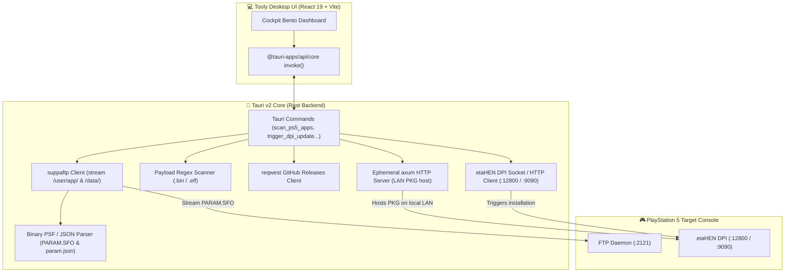

# AGENTS.md — Tooly Development Guide

## Project Overview
**Tooly** is a desktop application for PS5 Homebrew App & Payload Updating built with **Tauri v2 (Rust Backend)**, **Vite**, **React 19**, and **Tailwind CSS 4**.
It enables PS5 users on jailbroken firmwares to automatically scan installed apps via FTP (`:2121`), parse remote `PARAM.SFO` and `param.json` metadata on-the-fly, verify the latest releases against GitHub, and install updates with 1-click via etaHEN Direct Package Installer (DPI) on port `12800` (HTTP) or `9090` (TCP JSON socket) through an embedded ephemeral Rust HTTP file server.

---

## Design System: Antigravity 2026 x PS Retrofuturism

The visual identity fuses **PlayStation 2's retrofuturistic mysticism** with **2026 Liquid Glass & Spatial UI**:
- **Palette**: Deep voids (`#05070f`, `#0a0e1a`), Crystal Blue glow (`#0070d1`), Cybernetic Cyan (`#00f0ff`), and Translucent Glass (`backdrop-blur-md`).
- **Lighting & Micro-interactions**: Ambient radial glows, PlayStation symbols (△ ◯ ✕ □), glowing pill status badges, and Cockpit Bento Grid layouts.
- **IPC Communication**: Strictly uses `@tauri-apps/api/core` (`invoke`) for communication between React 19 and Rust commands.

---

## System Architecture



---

## Tauri IPC API Contract

All frontend-backend communication is routed through `@tauri-apps/api/core` (`invoke`) wrapped in [`src/lib/tauri-client.ts`](file:///Users/fede/Dev/Projects/tooly/src/lib/tauri-client.ts):

| Command | Arguments | Return Type | Description |
|---------|-----------|-------------|-------------|
| `scan_ps5_apps` | `{ ip: string, port?: number }` | `InstalledApp[]` | Scans `/user/app` and `/data` via FTP, streams and parses `PARAM.SFO` / `param.json`. |
| `scan_local_payloads` | `{ directory: string }` | `LocalPayload[]` | Scans a PC/USB folder for `.bin` and `.elf` payloads and extracts semver info via regex. |
| `check_github_update` | `{ repo: string }` | `GitHubReleaseInfo` | Fetches the latest release, asset links, and compares semantic version tags. |
| `trigger_dpi_update` | `{ ps5Ip: string, downloadUrl: string, fileName: string }` | `DpiInstallResponse` | Downloads PKG, spins up ephemeral `axum` HTTP server on local LAN, and triggers etaHEN DPI (`:12800` / `:9090`). |

---

## Directory Structure

```
tooly/
├── src-tauri/                # Rust backend (Tauri v2)
│   ├── Cargo.toml            # Rust dependencies (tauri, suppaftp, axum, reqwest, tokio)
│   ├── tauri.conf.json       # Tauri v2 configuration (window size, permissions)
│   ├── capabilities/         # Tauri v2 security capabilities (default.json)
│   └── src/
│       ├── lib.rs            # #[tauri::command] handlers & tauri::Builder
│       ├── main.rs           # Application entrypoint (calls tooly_lib::run())
│       └── modules/
│           ├── mod.rs        # Rust module exports
│           ├── sfo.rs        # Binary Sony PARAM.SFO (magic \0PSF) & param.json parser
│           ├── ftp_scanner.rs# PS5 FTP directory scanner & binary streamer
│           ├── payloads.rs   # Local PC/USB .bin & .elf payload regex scanner
│           ├── github.rs     # GitHub Releases API fetcher & version comparison
│           └── dpi.rs        # Ephemeral LAN HTTP server & DPI push trigger (:12800 / :9090)
├── src/                      # Frontend (Vite + React 19 + Tailwind CSS 4)
│   ├── components/
│   │   ├── dashboard.tsx     # Cockpit Bento Grid dashboard
│   │   └── ps-symbols.tsx    # PlayStation geometric glyphs (△ ◯ ✕ □)
│   ├── data/
│   │   └── registry.json     # Manifest mapping Title IDs to GitHub repositories
│   ├── lib/
│   │   ├── tauri-client.ts   # Strongly-typed Tauri IPC wrapper
│   │   ├── types.ts          # Shared TypeScript type definitions
│   │   └── utils.ts          # Styling helpers (clsx, twMerge)
│   ├── App.tsx               # Root component
│   ├── main.tsx              # ReactDOM root entrypoint
│   └── index.css             # Tailwind 4 & Liquid Glass tokens
├── package.json              # Frontend scripts & dependencies
├── vite.config.ts            # Vite & Tailwind 4 configuration
└── tsconfig.json             # TypeScript configuration
```

---

## Development Scripts
- `pnpm dev`: Inicia el servidor de desarrollo Vite (`http://localhost:1420`).
- `pnpm tauri dev`: Lanza Tooly en modo de escritorio nativo con Hot Reload.
- `pnpm build`: Compila TypeScript y empaqueta el frontend con Vite.
- `cargo check`: Valida el código y módulos de Rust en `src-tauri`.
- `pnpm tauri build`: Genera el ejecutable nativo empaquetado para distribución.

<!-- gitnexus:start -->
# GitNexus — Code Intelligence

This project is indexed by GitNexus as **tooly** (439 symbols, 719 relationships, 23 execution flows).

> Index stale? Run `node .gitnexus/run.cjs analyze --index-only` from the project root — it auto-selects an available runner. No `.gitnexus/run.cjs` yet? Bootstrap with `npx`, `bunx`, or `pnpm dlx` — e.g. `bunx gitnexus@latest analyze` (npm 11 npx crash; #1939).

## Always Do

- **MUST run impact before editing.** Use `impact({target: "symbolName", direction: "upstream"})` or `node .gitnexus/run.cjs impact "symbolName" --direction upstream --repo .`; report callers, processes, and risk. Never substitute grep for graph analysis.
- **MUST analyze graph changes before committing.** Use `detect_changes({scope: "all"})` (MCP) or `node .gitnexus/run.cjs detect-changes --scope all --repo .` (CLI fallback). `partial: true` or `truncated: true` is not a clean check — a zero means unseen, not unaffected; re-run it. For regression review: `detect_changes({scope: "compare", base_ref: "main"})` or `node .gitnexus/run.cjs detect-changes --scope compare --base-ref "main" --repo .`.
- MUST warn on HIGH/CRITICAL `risk` pre-edit; never use `riskSharedAxes` to waive a HIGH/CRITICAL `risk` warning. Compare File/symbol: MCP File omits axes; Graph-RAG expands File.
- **MUST treat `risk: UNKNOWN` as unresolved, not as low.** An empty caller set is not evidence the symbol is unused — it can also mean the callers are not resolvable by the index (plain-object property access, dynamic dispatch, cross-language calls). `impact` pairs `UNKNOWN` with a `riskNote` saying so. Confirm with a text search before treating the symbol as safe to change or delete; do not proceed on the strength of a zero.
- **MUST use `query({search_query: "concept"})` for concepts/flows, `context({name: "symbolName"})` for a named symbol, or `impact` for blast radius, on read-only callers, dependencies, imports, or execution flow.** Graph first; text search only for empty/`UNKNOWN`/literals.
- For security review, `explain({target: "fileOrSymbol"})` lists taint findings (source→sink flows; needs `analyze --pdg`).

## Never Do

- NEVER edit a function, class, or method before MCP/CLI impact analysis.
- NEVER ignore HIGH or CRITICAL risk warnings from impact analysis, and never read `UNKNOWN` as an all-clear — it means the walk could not answer, which is the one verdict that requires confirming by other means.
- NEVER rename symbols with find-and-replace — use `rename` which understands the call graph.
- NEVER commit before MCP/CLI graph change analysis.

## Resources

| Resource | Use for |
| --- | --- |
| `gitnexus://repo/tooly/context` | Codebase overview, check index freshness |
| `gitnexus://repo/tooly/clusters` | All functional areas |
| `gitnexus://repo/tooly/processes` | All execution flows |
| `gitnexus://repo/tooly/process/{name}` | Step-by-step execution trace |

## CLI

| Task | Read this skill file |
| --- | --- |
| Understand architecture / "How does X work?" | `.claude/skills/gitnexus-exploring/SKILL.md` |
| Blast radius / "What breaks if I change X?" | `.claude/skills/gitnexus-impact-analysis/SKILL.md` |
| Trace bugs / "Why is X failing?" | `.claude/skills/gitnexus-debugging/SKILL.md` |
| Rename / extract / split / refactor | `.claude/skills/gitnexus-refactoring/SKILL.md` |
| Tools, resources, schema reference | `.claude/skills/gitnexus-guide/SKILL.md` |
| Index, status, clean, wiki CLI commands | `.claude/skills/gitnexus-cli/SKILL.md` |

<!-- gitnexus:end -->
