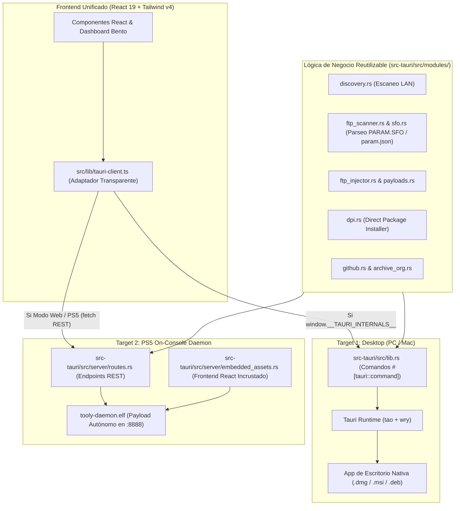

# 📋 Plan de Arquitectura e Implementación: Backend Unificado para Tooly
> **Pregunta clave:** *¿Hay que escribir 2 backends para soportar Desktop (PC/Mac) y PS5 On-Console?*  
> **Respuesta:** **NO.** Unificaremos la arquitectura para tener **un solo backend en Rust (compartiendo el 95%+ del código)** y **un solo frontend en React 19**, compilable para dos targets diferentes.

---

## 1. Visión General de la Arquitectura



---

## 2. Los Dos Targets de Entrega

| Aspecto | Target 1: Desktop (PC / Mac) | Target 2: PS5 Daemon (.elf) |
| :--- | :--- | :--- |
| **Entorno de ejecución** | macOS, Windows, Linux | PlayStation 5 (firmwares 1.00 - 13.60+) |
| **Formato binario** | `.dmg` / `.app`, `.msi` / `.exe` | Binario ELF estático autónomo (`tooly-daemon.elf`) |
| **Backend de Rust** | `src-tauri/src/main.rs` (Tauri v2) | `src-tauri/src/bin/daemon.rs` (Axum + Tokio) |
| **Frontend** | WebView de escritorio (WKWebView / WebView2) | Servido vía HTTP por Axum a cualquier navegador (PS5 User Guide, móvil, PC) |
| **Empaquetado de assets** | Gestionado por Tauri CLI | Incrustados en el `.elf` mediante `rust-embed` |
| **Conexión a PS5** | Escaneo LAN o IP remota introducida por el usuario | Autodetección: Se conecta a `127.0.0.1` automáticamente |

---

## 3. Plan de Cambios Paso a Paso

### Fase 1: Capa de Transporte Transparente en el Frontend (React 19)

Actualmente, todas las llamadas al backend están perfectamente centralizadas en [`src/lib/tauri-client.ts`](src/lib/tauri-client.ts) (13 métodos en total) y un listener de eventos en `src/components/dashboard.tsx`.

#### Modificación: `src/lib/tauri-client.ts`
Implementar un fallback transparente:
- Si detecta `window.__TAURI_INTERNALS__`, ejecuta `invoke<T>(command, args)`.
- Si **no** detecta Tauri (ejecución web normal), realiza un `fetch('/api/' + command, { method: 'POST', body: JSON.stringify(args) })`.

```typescript
import { invoke } from "@tauri-apps/api/core";

export const isTauri = (): boolean => {
  return typeof window !== "undefined" && "__TAURI_INTERNALS__" in window;
};

async function executeCommand<T>(command: string, args?: Record<string, unknown>): Promise<T> {
  if (isTauri()) {
    return await invoke<T>(command, args);
  }

  // Fallback REST para Daemon en PS5 / Web
  const res = await fetch(`/api/${command}`, {
    method: "POST",
    headers: { "Content-Type": "application/json" },
    body: JSON.stringify(args ?? {}),
  });

  if (!res.ok) {
    const err = await res.json().catch(() => ({ message: res.statusText }));
    throw new Error(err.message || `Error HTTP ${res.status}`);
  }

  return await res.json();
}
```

#### Eventos de Progreso (`dpi-progress`):
- En Tauri: sigue usando `listen("dpi-progress", callback)`.
- En Web: conectarse a un endpoint SSE (Server-Sent Events) en `/api/events` o polling ligero.

---

### Fase 2: Configuración del Proyecto Rust (`src-tauri`)

#### Modificación: `src-tauri/Cargo.toml`
Configurar dependencias para servir estáticos embebidos y declarar los dos binarios:

```toml
[dependencies]
# ... dependencias actuales ...
rust-embed = { version = "8", features = ["interpolate-folder-path"] }
mime_guess = "2"

[[bin]]
name = "tooly"
path = "src/main.rs"

[[bin]]
name = "tooly-daemon"
path = "src/bin/daemon.rs"
```

---

### Fase 3: Rutas REST en Axum y Assets Embebidos

#### Creación: `src-tauri/src/server/routes.rs`
Mapea cada uno de los 13 comandos existentes en `src-tauri/src/lib.rs` directamente a handlers de Axum, reutilizando el 100% de los módulos existentes (`DiscoveryService`, `FtpScanner`, `DpiService`, `GitHubClient`, etc.):

* `POST /api/check_app_update`
* `POST /api/discover_ps5_consoles`
* `POST /api/start_scan_ps5_apps`
* `POST /api/cancel_scan`
* `POST /api/scan_ps5_apps`
* `POST /api/scan_local_payloads`
* `POST /api/check_github_update`
* `POST /api/check_batch_github_updates`
* `POST /api/trigger_dpi_update`
* `POST /api/search_archive_updates`
* `POST /api/install_archive_update_direct`
* `POST /api/update_payload_via_ftp`
* `POST /api/start_ps5_ftp_server`

#### Creación: `src-tauri/src/server/embedded_assets.rs`
Incrusta la carpeta `dist/` generada por Vite dentro del binario de Rust. Cualquier petición GET que no sea `/api/*` entrega el `index.html` o los archivos `.js`/`.css`/`.png` con el MIME type correcto en memoria:

```rust
use axum::{
    body::Body,
    http::{header, HeaderValue, Response, StatusCode, Uri},
    response::IntoResponse,
};
use rust_embed::RustEmbed;

#[derive(RustEmbed)]
#[folder = "../dist"]
struct WebAssets;

pub async fn static_handler(uri: Uri) -> impl IntoResponse {
    let path = uri.path().trim_start_matches('/');
    let target = if path.is_empty() { "index.html" } else { path };

    match WebAssets::get(target).or_else(|| WebAssets::get("index.html")) {
        Some(content) => {
            let mime = mime_guess::from_path(target).first_or_octet_stream();
            Response::builder()
                .status(StatusCode::OK)
                .header(header::CONTENT_TYPE, HeaderValue::from_str(mime.as_ref()).unwrap())
                .body(Body::from(content.data))
                .unwrap()
        }
        None => Response::builder()
            .status(StatusCode::NOT_FOUND)
            .body(Body::from("404 Not Found"))
            .unwrap(),
    }
}
```

#### Creación: `src-tauri/src/bin/daemon.rs`
El ejecutable headless que correrá en segundo plano en la PS5 o en cualquier servidor:

```rust
use axum::Router;
use std::net::SocketAddr;
use tokio::net::TcpListener;

mod server;

#[tokio::main]
async fn main() -> Result<(), Box<dyn std::error::Error>> {
    let app = Router::new()
        .merge(server::create_api_router())
        .fallback(server::static_handler);

    let port: u16 = std::env::var("TOOLY_PORT")
        .ok()
        .and_then(|p| p.parse().ok())
        .unwrap_or(8888);

    let addr = SocketAddr::from(([0, 0, 0, 0], port));
    println!("🎮 Tooly Daemon activo en http://{}", addr);

    let listener = TcpListener::bind(addr).await?;
    axum::serve(listener, app).await?;
    Ok(())
}
```

---

### Fase 4: Autodetección de Entorno Local (PS5 Mode)

En el frontend (`src/store/ps5-store.ts` o componente de conexión):
- Si corre en modo Web/Daemon: consultar `/api/system_info`.
- Si reporta que está corriendo dentro de la consola, omitir el diálogo de escaneo de subnet y fijar el destino automáticamente a `127.0.0.1` (puertos `:2121` y `:12800` locales de etaHEN).

---

### Fase 5: Pipeline de Compilación para PS5

#### Creación: `scripts/build-ps5-daemon.sh`
Script automatizado para compilar el ejecutable listo para PS5:

1. **Compilar el frontend web:**
   ```bash
   pnpm build
   ```
2. **Compilar el daemon estático en Rust:**
   ```bash
   cd src-tauri
   cargo build --release --bin tooly-daemon --target x86_64-unknown-freebsd
   ```
3. **Generar el ejecutable final:**
   El resultado es `src-tauri/target/x86_64-unknown-freebsd/release/tooly-daemon`, renombrable a `tooly-daemon.elf`.

---

## 4. Matriz de Compatibilidad y Ventajas

1. **Zero duplicación de lógica:** Todos los parsers de `PARAM.SFO`, el cliente FTP, la integración con GitHub Releases y el servidor DPI de etaHEN permanecen en un único lugar.
2. **Independencia total del WebView de PS5:** El usuario no sufre las limitaciones del motor WebKit de la consola porque la app se ejecuta desde el navegador del sistema o de forma remota desde cualquier teléfono, iPad o laptop apuntando a `http://<ip-de-tu-ps5>:8888`.
3. **Distribución ultra-simple:** Un único archivo `.elf` que se coloca en `/data/etaHEN/payloads/` para que inicie automáticamente al encender la consola con jailbreak.

---

## 5. Plan de Verificación

### Pruebas de Desktop:
1. `pnpm build && pnpm tauri build --no-bundle`
2. Verificar que la app de escritorio en macOS/Windows sigue funcionando exactamente igual.

### Pruebas de Daemon / Web:
1. `pnpm build`
2. `cargo run --bin tooly-daemon`
3. Abrir `http://localhost:8888` en el navegador.
4. Probar escaneo de apps, búsqueda de updates en GitHub e inicio de DPI desde la interfaz web.
