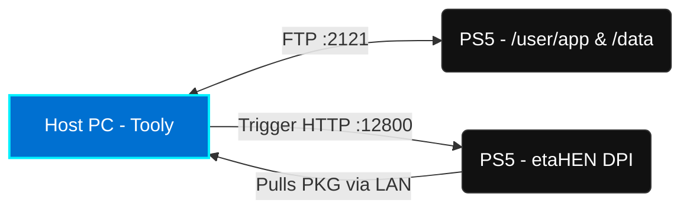
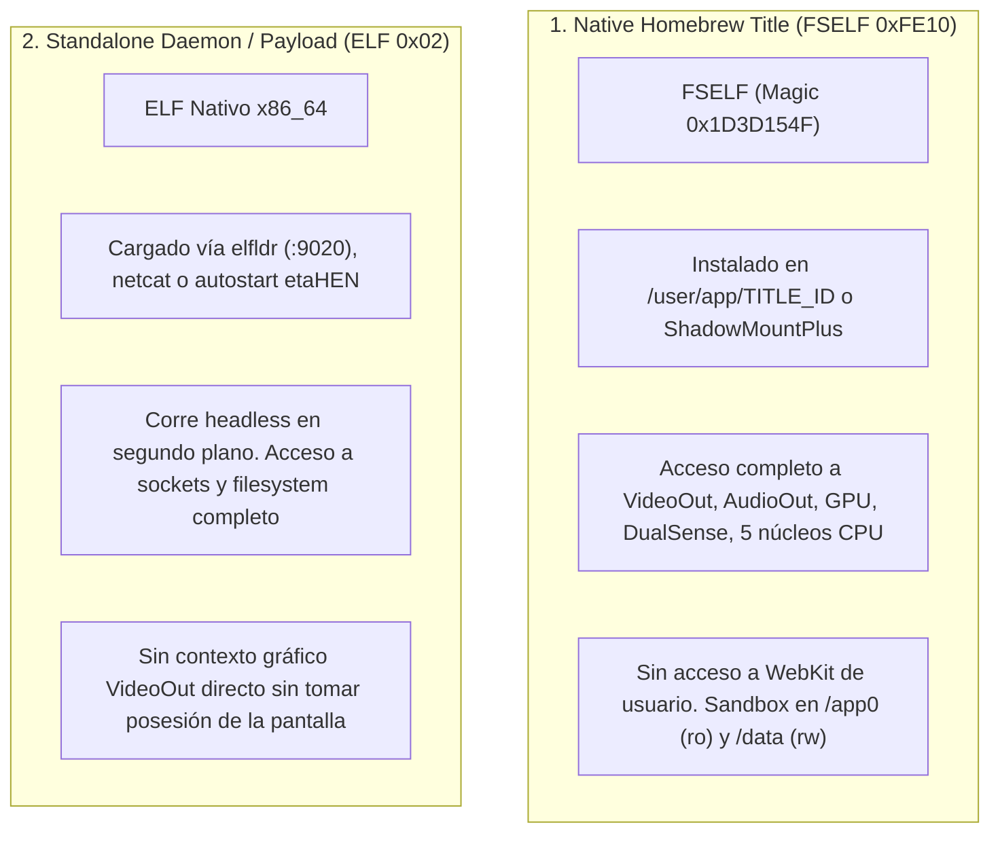

<div align="center">
  

  <br />
  <br />

  # 🎮 Tooly: The Ultimate PS5 Homebrew Companion

  <p align="center">
    <strong>Next-Generation Desktop Companion for PlayStation 5 Homebrew Management, Automated Updates, Payload Deployment, and Game Update Discovery.</strong>
  </p>

  <p align="center">
    <a href="#-key-features"></a>
    <a href="https://v2.tauri.app/"></a>
    <a href="https://react.dev/"></a>
    <a href="https://tailwindcss.com/"></a>
    <a href="https://www.rust-lang.org/"></a>
  </p>

  <p align="center">
    <a href="#-overview">Overview</a> •
    <a href="#-features-in-action">Features in Action</a> •
    <a href="#-network-architecture--ports">Architecture</a> •
    <a href="#-quick-start-guide">Quick Start</a> •
    <a href="#-faq">FAQ</a>
  </p>
</div>

---

## 📌 Overview

Are you tired of slow USB transfers and complex multi-step processes for updating your PS5 homebrew apps? **Tooly** is the definitive **PlayStation 5 Homebrew Manager** designed to bridge your PC and jailbroken PS5 (firmwares 1.00 – 13.60+ / etaHEN compatible) into a seamless, integrated operations center. 

Built on a lightning-fast Rust backend with Tauri v2 and a stunning React 19 interface, Tooly eliminates tedious manual payload injection and PKG installation. With features like subnet auto-discovery, zero-latency metadata parsing, verified GitHub Release catalog tracking, and high-speed Direct Package Installer (DPI) pushes, managing your PS5 ecosystem is finally a one-click experience.

### 🎥 See Tooly in Action

Watch our quick walkthrough showcasing the Antigravity 2026 design and 1-click install capabilities.

<div align="center">
  <video src="./video/out/tooly-16x9.mp4" controls="controls" muted="muted" style="max-width: 100%; border-radius: 8px; box-shadow: 0 4px 12px rgba(0,0,0,0.15);"></video>
  <p><em>(Click to play the 16:9 Demo Video)</em></p>
  <p>📱 Also available in <a href="./video/out/tooly-9x16.mp4">9:16 Vertical format for Shorts/Reels</a>.</p>
</div>

---

## 📸 Features in Action

Experience modern retrofuturism with Tooly's **Antigravity 2026 x PS2 Mysticism** design system, featuring crystalline blue glows (`#0070d1`), cybernetic cyan (`#00f0ff`), and translucent acrylic glass components.

### 🔍 1. Subnet Auto-Discovery & Zero-Config Connection
Scan your local WiFi or Ethernet network (`/24`) in milliseconds. Tooly automatically locates your active PS5 console by probing for standard homebrew services like FTP (`:2121`) and etaHEN Direct Package Installer (`:12800`). No more manually typing IP addresses.

<p align="center">
  
</p>

### 🛸 2. Cockpit Bento Dashboard & Smart Parsing
Once connected, Tooly instantly scans `/user/app/` and `/data/homebrew/`, parsing Sony's proprietary `PARAM.SFO` and `param.json` binaries entirely in-memory. It smartly pairs frontend web launchers with their backend payloads (e.g., merging `FMGR88888` and its payload daemon into a single card) to keep your dashboard clean.

<p align="center">
  
</p>

### ⚡ 3. 1-Click Remote Installation (DPI Push)
Stop waiting for FTP transfers to finish before installing. When an update is found via our built-in GitHub Releases catalog, Tooly downloads the PKG, spins up an **ephemeral high-throughput HTTP server in Rust**, and triggers etaHEN's DPI (`:12800`). Your PS5 pulls the PKG directly over the LAN at gigabit speeds.

<p align="center">
  
</p>

---

## 🛠️ Network Architecture & Ports

Tooly communicates directly with the standard homebrew daemons already running on your jailbroken PlayStation 5.

| Port | Protocol | Purpose & Service |
|:---:|:---:|---|
| **`2121`** | FTP | **etaHEN / FTPSrv**: Reading installed metadata (`PARAM.SFO`) & pushing payloads |
| **`12800`** | HTTP (REST) | **etaHEN DPI**: Direct Package Installer trigger port |
| **`9090`** | TCP Socket | **etaHEN Socket**: Alternative JSON command socket |
| **`8844` / `8888`** | HTTP | Remote Web daemons (PKG-Manager, WebFileManager) |
| **`10101`** | HTTP | ShadowMount+ Web Server |

### Flow Diagram



---

## 🧠 AI Agent Skill: PS5 Scene Developer

Equip your AI assistant (**Google Antigravity**, **Claude Code**, **Cursor**, **Cline**, **Windsurf**, or **GitHub Copilot**) with expert-level knowledge of PlayStation 5 homebrew architecture, low-level execution models (FSELF vs. ELF payloads), DirectMemory heap arenas (`--wrap=malloc`), POSIX-to-`libSceNet` socket translation, `libSceVideodec2` hardware video decoding, zero-copy `ps5-opengl` presentation, DualSense input, and packaging.

### 📥 Installation in 1 Step

Copy the file [`ps5-scene-developer/SKILL.md`](.agents/skills/ps5-scene-developer/SKILL.md) to your workspace or global agent folder:

```bash
# 1. Option A: Install in this repository (.agents/skills/)
mkdir -p .agents/skills/ps5-scene-developer
cp .agents/skills/ps5-scene-developer/SKILL.md .agents/skills/ps5-scene-developer/SKILL.md

# 2. Option B: Install globally for all projects (Google Antigravity / Gemini CLI)
mkdir -p ~/.gemini/config/skills/ps5-scene-developer
cp .agents/skills/ps5-scene-developer/SKILL.md ~/.gemini/config/skills/ps5-scene-developer/SKILL.md
```

<details>
<summary>📋 <strong>Click to expand and copy the complete <code>SKILL.md</code></strong></summary>

```markdown
---
name: ps5-scene-developer
description: "Master guide for PlayStation 5 (PS5) Homebrew and Scene development. Covers native execution models (FSELF 0xFE10, elfldr, payloads), ps5-payload-sdk, memory management (DirectMemory, sceLibcMspace, --wrap=malloc), network translation (POSIX sockets to libSceNet, epoll, DNS resolver), hardware video decoding (libSceVideodec2, x86 clflush/mfence), GPU zero-copy presentation (ps5-opengl, EGL, scanout HDR/120Hz), DualSense input (libScePad), audio (libSceAudioOut), packaging (param.json, icon0, pic0, ShadowMountPlus, etaHEN DPI, FFPKG), and Rust/C++ cross-compilation."
version: 1.0.0
---

# PS5 Scene & Homebrew Development Skill

> Complete technical guide for developing, reverse engineering, and packaging native homebrew applications, background daemons, and payloads for the PlayStation 5 (Firmwares 1.00 – 13.60+ / etaHEN / ShadowMountPlus).

---

## 1. System Architecture & Execution Environments

The PS5 runs **Prospero OS**, a heavily modified derivative of **FreeBSD 12** executing on an **x86_64 AMD Zen 2** APU with RDNA 2 graphics.

### The Two Execution Models



---

## 2. Toolchains & Compilación Cruzada

### A. Entorno C / C++ (ps5-payload-sdk)
El estándar de la scene es **`ps5-payload-sdk`** junto con herramientas basadas en LLVM 18 (`prospero-clang`, `prospero-lld`, `prospero-ar`):

* **Compilador C/C++:** `clang-18 -target x86_64-sie-ps5` (o wrapper `prospero-clang18`)
* **Flags recomendados:**
  ```sh
  -std=c++20 -O2 -fPIC -ffunction-sections -fdata-sections -fno-exceptions -fno-rtti
  ```
* **Librerías portadas (PacBrew):** Sysroot aislado que provee `libcurl`, `openssl`, `opus`, `libavcodec`, `zlib`, `zstd`.

### B. Entorno Rust
Para compilar código Rust (como Tooly o daemons en Axum/Tokio):
1. **Target:** Utiliza `x86_64-unknown-freebsd` o un target JSON de Rust con ABI SysV AMD64:
   ```sh
   cargo build --release --target x86_64-unknown-freebsd
   ```
2. **Dependencias de Red:** Usa implementaciones basadas en Rustls o sockets estándar FreeBSD.

---

## 3. Trampa Crítica: Memoria y Allocator (`--wrap=malloc`)

### El Problema
En títulos nativos de PS5, el heap de la `libc` estándar es limitado y se fragmenta con rapidez (provocando errores como `Could not allocate memory` en decodificadores o servidores de red).

### La Solución (Patrón ProsperoLight / OpenNOW)
Interceptar la familia `malloc` con el linker (`-Wl,--wrap=malloc,--wrap=calloc,--wrap=realloc,--wrap=free,--wrap=posix_memalign`) y alojar un sub-heap de **128 MiB o 256 MiB** en memoria física directa:

```c
// 1. Asignar memoria física directa
int64_t phys_start = -1;
sceKernelAllocateDirectMemory(0, sceKernelGetDirectMemorySize(), 128 * 1024 * 1024, 0x4000, 12, &phys_start);

// 2. Mapear la memoria directa al espacio virtual
void* heap_base = NULL;
sceKernelMapDirectMemory(&heap_base, 128 * 1024 * 1024, PROT_READ | PROT_WRITE, 0, phys_start, 0x4000);

// 3. Crear arena mspace independiente
void* ps5_mspace = sceLibcMspaceCreate("AppHeap", heap_base, 128 * 1024 * 1024, 0);

// 4. Implementar los wrappers de malloc
void* __wrap_malloc(size_t size) {
    void* ptr = sceLibcMspaceMalloc(ps5_mspace, size);
    if (!ptr) ptr = __real_malloc(size); // Fallback limpio a libc
    return ptr;
}
void __wrap_free(void* ptr) {
    if (ptr >= heap_base && ptr < (void*)((uintptr_t)heap_base + 128 * 1024 * 1024)) {
        sceLibcMspaceFree(ps5_mspace, ptr);
    } else {
        __real_free(ptr);
    }
}
```

---

## 4. Red en PS5: Capa de Adaptación `libSceNet`

En títulos nativos, las llamadas estándar `socket()`, `connect()`, etc., **no existen directamente** a nivel de syscalls POSIX y deben traducirse a `libSceNet.prx`:

### Mapeo de Funciones

| POSIX Standard | Equivalente PS5 (`libSceNet`) | Notas |
| :--- | :--- | :--- |
| `socket(af, type, proto)` | `sceNetSocket("app", af, type, proto)` | Retirar flags `SOCK_NONBLOCK` del `type` antes de llamar. |
| Non-blocking mode | `sceNetSetsockopt(s, SOL_SOCKET, 0x1200, &on, 4)` | Constante `SCE_NET_SO_NBIO = 0x1200`. |
| `connect()`, `bind()` | `sceNetConnect()`, `sceNetBind()` | Parámetros idénticos a BSD. |
| `send()`, `recv()` | `sceNetSend()`, `sceNetRecv()` | Parámetros idénticos. |
| `poll()`, `select()` | `sceNetEpollCreate()`, `sceNetEpollControl()`, `sceNetEpollWait()` | Emular mediante epoll de `sceNet`. |
| `getaddrinfo()` | `sceNetResolverStartNtoa()` | Requiere crear un pool con `sceNetPoolCreate()`. |
| Entropía / PRNG | `sysctl(kern.rng_pseudo)` | **Nunca** importar `sceRandomGetRandomNumber` en títulos sin privilegios. |

---

## 5. Decodificación de Vídeo por Hardware (`libSceVideodec2`)

La PS5 cuenta con decodificación de hardware de ultra baja latencia para **H.264** y **HEVC (Main / Main10 4K 120 FPS)**.

### Pasos de Implementación
1. **Cargar módulo:** `sceSysmoduleLoadModule(207);` (`libSceVideodec2`).
2. **Afinidad de Hilos:** Consultar `cpuset_getaffinity()` del hilo actual y enmascarar hasta 5 pares SMT (10 hilos de decodificación).
3. **Memoria Directa:**
   - Asignar Compute Queue memory con protección `0x33`.
   - Asignar Picture Pool (12 slots para DPB de 6 tramas en HEVC o 4 en H.264 + tramas en tránsito de presentación).
4. **Coherencia de Caché en x86:**
   ```c
   // CRÍTICO: Debe invalidarse la caché antes de entregar la AU al decodificador
   for (size_t n = 0; n < bytes; n += 64) {
       __builtin_ia32_clflush(input_buffer + n);
   }
   __builtin_ia32_mfence();
   ```
5. **Decodificación:** Invocar `sceVideodec2Decode(decoder, &input, &frame, &output)`. La salida es devuelta en planar NV12 o R16+RG16 (10-bit).

---

## 6. Presentación Gráfica Zero-Copy (`ps5-opengl`)

Para evitar copias innecesarias de texturas 4K de la CPU a la GPU:

1. **Creación de Memory Images:**
   ```c
   void* y_image  = ps5_opengl_memory_image_create(surface.buffer, pitch, rows, pitch, 1, bpp);
   void* uv_image = ps5_opengl_memory_image_create(surface.buffer + pitch * rows, pitch / 2, rows / 2, pitch, 2, bpp);
   ```
2. **Vinculación a Texturas GL:**
   ```c
   PFNGLEGLIMAGETARGETTEXTURE2DOESPROC glEGLImageTargetTexture2DOES = 
       (PFNGLEGLIMAGETARGETTEXTURE2DOESPROC)eglGetProcAddress("glEGLImageTargetTexture2DOES");

   glBindTexture(GL_TEXTURE_2D, texY);
   glEGLImageTargetTexture2DOES(GL_TEXTURE_2D, y_image);
   ```
3. **Modos de Pantalla y HDR10:**
   - 4K / 120 Hz: `eglSetDisplayModePS5(disp, 3840, 2160); eglSetDisplayRefreshPS5(disp, 120);`
   - Conmutar scanout a HDR10: `ps5_opengl_set_scanout_format(0x8100070422000000ULL, results);`

---

## 7. Audio Multicanal y Controles DualSense

### Audio (`libSceAudioOut`)
* **Inicialización:** `sceAudioOutInit();`
* **Apertura de puerto:** `int handle = sceAudioOutOpen(0xff, 0, 0, 256, 48000, is_surround ? 2 : 1);`
  - Modo `1`: 2 canales (Estéreo).
  - Modo `2`: 8 canales (5.1 / 7.1 Surround).
* **Envío de muestras:** `sceAudioOutOutput(handle, pcm_samples_16bit);`

### Mando (`libScePad`)
```c
sceUserServiceInitialize(NULL);
scePadInit();

int user = -1;
sceUserServiceGetInitialUser(&user);
int pad = scePadOpen(user, 0, 0, NULL);

PS5_PadData data;
if (scePadReadState(pad, &data) == 0 && data.connected) {
    // data.buttons: PS5_PAD_BUTTON_CROSS, PS5_PAD_BUTTON_OPTIONS, etc.
    // data.leftStick.x, data.leftStick.y (0..255)
    // data.analogButtons.l2, data.analogButtons.r2 (0..255)
    // data.touch: Coordenadas táctiles del touchpad
}
```

---

## 8. Empaquetado y Metadatos de la PS5

Estructura de una aplicación homebrew para cargadores de directorio (ej. **ShadowMountPlus**):

```text
PPSA99082/
├── eboot.bin                # FSELF firmado (ELF ejecutable)
├── sce_module/
│   └── libc.prx             # Clean-room shim de compatibilidad
├── sce_sys/
│   ├── param.json           # Metadatos del título
│   ├── icon0.png            # Icono del launcher (512x512 PNG)
│   ├── pic0.dds             # Fondo al seleccionar la app (3840x2160 BC7 DX10)
│   ├── pic1.dds             # Fondo de transición de arranque (3840x2160 BC7 DX10)
│   └── snd0.at9             # Audio en bucle opcional (ATRAC9 48 kHz estéreo <= 2 MB)
└── assets/                  # Assets propios de la aplicación
```

---

## 9. Puertos y Servicios de Red Estándar en la Scene

| Puerto | Protocolo | Servicio / Uso |
|:---:|:---:|---|
| **`2121`** | FTP | Servidor FTP de etaHEN / FTPSrv (Acceso a `/user/app/` y `/data/`) |
| **`12800`** | HTTP REST | etaHEN Direct Package Installer (DPI) para instalar PKGs |
| **`9090`** | TCP JSON | etaHEN IPC Socket |
| **`9020`** | TCP Raw | Receptor de Payloads `elfldr` |
| **`8888` / `8844`**| HTTP | Daemons web remotos (WebFileManager, PKG-Manager, Tooly Daemon) |
```

</details>

---

## 🚀 Quick Start Guide

Ready to supercharge your PS5 homebrew workflow? Follow these steps to get Tooly running locally.

### Prerequisites
*   **Node.js** (v20+ LTS)
*   **pnpm** (run `corepack enable pnpm`)
*   **Rust Toolchain** (Install via [rustup.rs](https://rustup.rs/))
*   Platform native build dependencies (Xcode CLI tools for macOS, VS C++ build tools for Windows, or `build-essential` for Linux)

### Installation & Development

```bash
# 1. Clone the repository
git clone https://github.com/Thefederico/tooly.git
cd tooly

# 2. Install frontend dependencies
pnpm install

# 3. Launch the desktop development environment (Tauri v2 + Vite Hot Reload)
pnpm tauri dev
```

### Building for Production

```bash
# Compile desktop installer (.dmg on macOS, .exe / .msi on Windows, .deb / .AppImage on Linux)
pnpm tauri build
```

---

## ❓ FAQ

**Do I need etaHEN running on my PS5?**
Yes, for 1-click DPI installations and payload management, having **etaHEN** enabled is highly recommended. For basic metadata and app scanning, any active FTP daemon listening on port `2121` is sufficient.

**Can I add my own homebrew apps to the catalog?**
Yes! The verified catalog is located in `src/data/registry.json`. You can easily contribute new apps by submitting a pull request following our [App Submission Guide](SUBMITTING_APPS.md).

**What firmwares are supported?**
Tooly works flawlessly with any jailbreakable PS5 firmware (including 1.xx, 2.xx, 3.xx, 4.xx, 5.xx, and newer offsets supported by etaHEN/kstuff).

---

## 🤝 Contributing & Documentation

*   [Documentation & Architecture Guides](docs/README.md)
*   [Network & Ports Detailed Guide](docs/network-ports.md)

## 📄 License & Credits

Distributed under the **MIT License**. See `LICENSE` for more information.

Developed with 💙 for the PlayStation homebrew community by [Federico Upegui](https://github.com/Thefederico).
