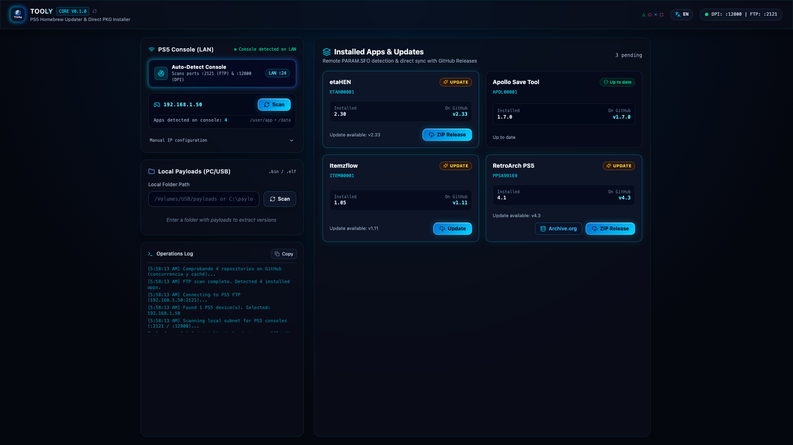
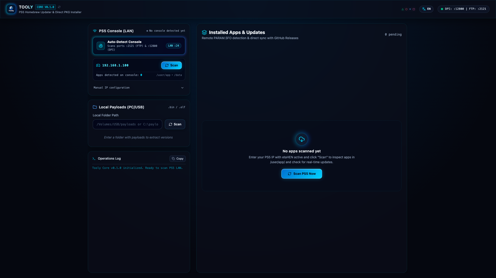
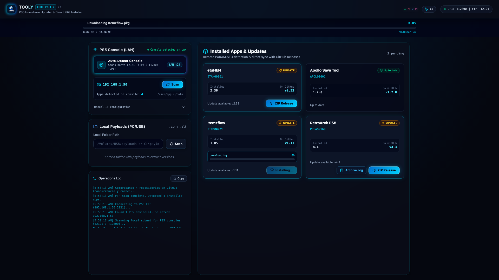
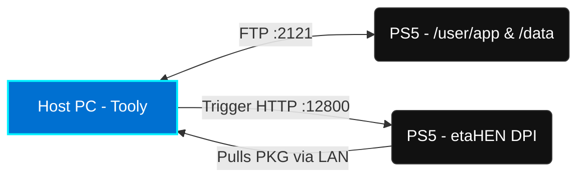

<div align="center">
  

  <br />
  <br />

  # 🎮 Tooly: The Ultimate PS5 Homebrew Companion

  <p align="center">
    <strong>Next-Generation Desktop Companion for PlayStation 5 Homebrew Management, Automated Updates, Payload Deployment, and Game Update Discovery.</strong>
  </p>

  <p align="center">
    <a href="#-key-features"></a>
    <a href="https://v2.tauri.app/"></a>
    <a href="https://react.dev/"></a>
    <a href="https://tailwindcss.com/"></a>
    <a href="https://www.rust-lang.org/"></a>
  </p>

  <p align="center">
    <a href="#-overview">Overview</a> •
    <a href="#-features-in-action">Features in Action</a> •
    <a href="#-network-architecture--ports">Architecture</a> •
    <a href="#-quick-start-guide">Quick Start</a> •
    <a href="#-faq">FAQ</a>
  </p>
</div>

---

## 📌 Overview

Are you tired of slow USB transfers and complex multi-step processes for updating your PS5 homebrew apps? **Tooly** is the definitive **PlayStation 5 Homebrew Manager** designed to bridge your PC and jailbroken PS5 (firmwares 1.00 – 13.60+ / etaHEN compatible) into a seamless, integrated operations center. 

Built on a lightning-fast Rust backend with Tauri v2 and a stunning React 19 interface, Tooly eliminates tedious manual payload injection and PKG installation. With features like subnet auto-discovery, zero-latency metadata parsing, verified GitHub Release catalog tracking, and high-speed Direct Package Installer (DPI) pushes, managing your PS5 ecosystem is finally a one-click experience.

### 🎥 See Tooly in Action

Watch our quick walkthrough showcasing the Antigravity 2026 design and 1-click install capabilities.

<div align="center">
  <video src="./video/out/tooly-16x9.mp4" controls="controls" muted="muted" style="max-width: 100%; border-radius: 8px; box-shadow: 0 4px 12px rgba(0,0,0,0.15);"></video>
  <p><em>(Click to play the 16:9 Demo Video)</em></p>
  <p>📱 Also available in <a href="./video/out/tooly-9x16.mp4">9:16 Vertical format for Shorts/Reels</a>.</p>
</div>

---

## 📸 Features in Action

Experience modern retrofuturism with Tooly's **Antigravity 2026 x PS2 Mysticism** design system, featuring crystalline blue glows (`#0070d1`), cybernetic cyan (`#00f0ff`), and translucent acrylic glass components.

### 🔍 1. Subnet Auto-Discovery & Zero-Config Connection
Scan your local WiFi or Ethernet network (`/24`) in milliseconds. Tooly automatically locates your active PS5 console by probing for standard homebrew services like FTP (`:2121`) and etaHEN Direct Package Installer (`:12800`). No more manually typing IP addresses.

<p align="center">
  
</p>

### 🛸 2. Cockpit Bento Dashboard & Smart Parsing
Once connected, Tooly instantly scans `/user/app/` and `/data/homebrew/`, parsing Sony's proprietary `PARAM.SFO` and `param.json` binaries entirely in-memory. It smartly pairs frontend web launchers with their backend payloads (e.g., merging `FMGR88888` and its payload daemon into a single card) to keep your dashboard clean.

<p align="center">
  
</p>

### ⚡ 3. 1-Click Remote Installation (DPI Push)
Stop waiting for FTP transfers to finish before installing. When an update is found via our built-in GitHub Releases catalog, Tooly downloads the PKG, spins up an **ephemeral high-throughput HTTP server in Rust**, and triggers etaHEN's DPI (`:12800`). Your PS5 pulls the PKG directly over the LAN at gigabit speeds.

<p align="center">
  
</p>

---

## 🛠️ Network Architecture & Ports

Tooly communicates directly with the standard homebrew daemons already running on your jailbroken PlayStation 5.

| Port | Protocol | Purpose & Service |
|:---:|:---:|---|
| **`2121`** | FTP | **etaHEN / FTPSrv**: Reading installed metadata (`PARAM.SFO`) & pushing payloads |
| **`12800`** | HTTP (REST) | **etaHEN DPI**: Direct Package Installer trigger port |
| **`9090`** | TCP Socket | **etaHEN Socket**: Alternative JSON command socket |
| **`8844` / `8888`** | HTTP | Remote Web daemons (PKG-Manager, WebFileManager) |
| **`10101`** | HTTP | ShadowMount+ Web Server |

### Flow Diagram



---

## 🚀 Quick Start Guide

Ready to supercharge your PS5 homebrew workflow? Follow these steps to get Tooly running locally.

### Prerequisites
*   **Node.js** (v20+ LTS)
*   **pnpm** (run `corepack enable pnpm`)
*   **Rust Toolchain** (Install via [rustup.rs](https://rustup.rs/))
*   Platform native build dependencies (Xcode CLI tools for macOS, VS C++ build tools for Windows, or `build-essential` for Linux)

### Installation & Development

```bash
# 1. Clone the repository
git clone https://github.com/Thefederico/tooly.git
cd tooly

# 2. Install frontend dependencies
pnpm install

# 3. Launch the desktop development environment (Tauri v2 + Vite Hot Reload)
pnpm tauri dev
```

### Building for Production

```bash
# Compile desktop installer (.dmg on macOS, .exe / .msi on Windows, .deb / .AppImage on Linux)
pnpm tauri build
```

---

## ❓ FAQ

**Do I need etaHEN running on my PS5?**
Yes, for 1-click DPI installations and payload management, having **etaHEN** enabled is highly recommended. For basic metadata and app scanning, any active FTP daemon listening on port `2121` is sufficient.

**Can I add my own homebrew apps to the catalog?**
Yes! The verified catalog is located in `src/data/registry.json`. You can easily contribute new apps by submitting a pull request following our [App Submission Guide](SUBMITTING_APPS.md).

**What firmwares are supported?**
Tooly works flawlessly with any jailbreakable PS5 firmware (including 1.xx, 2.xx, 3.xx, 4.xx, 5.xx, and newer offsets supported by etaHEN/kstuff).

---

## 🤝 Contributing & Documentation

*   [Documentation & Architecture Guides](docs/README.md)
*   [Network & Ports Detailed Guide](docs/network-ports.md)

## 📄 License & Credits

Distributed under the **MIT License**. See `LICENSE` for more information.

Developed with 💙 for the PlayStation homebrew community by [Federico Upegui](https://github.com/Thefederico).
